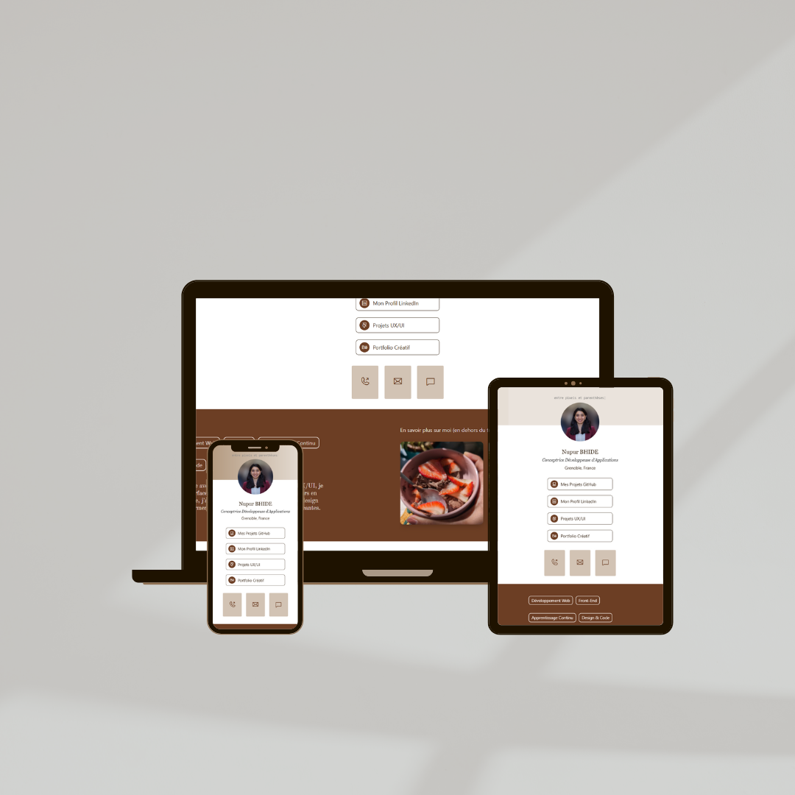

## 🖼️ Preview

  

# Linktree – Page de Liens Responsive

Bienvenue sur cette page de liens personnelle, conçue pour **centraliser vos accès en un seul endroit**.  
Ce projet est développé en **HTML et CSS**, avec une approche **mobile-first** et un style épuré.

Optimisée pour les mobiles, cette page s’adapte à tous les écrans.  
Des effets au survol et une présentation claire assurent une navigation fluide.

## Fonctionnalités :
- Regroupe vos liens importants  
- Design responsive, mobile d’abord  
- Effets CSS discrets (hover, transitions)

## Voir en ligne : https://nbhd12.github.io/linktree/  
*Simple, efficace, accessible !*

---

## Linktree – Responsive Link Page (EN)

This is a personal **link page** built to **centralize all your important links** in one place.  
Created using **HTML and CSS**, the layout follows a **mobile-first** design with a clean visual style.

Optimized for smartphones and responsive across screen sizes  
Smooth hover effects and clear visual structure for easy use

## Features:
- Centralizes all key links  
- Mobile-first responsive layout  
- Subtle CSS hover and transition effects

## Live Preview: https://nbhd12.github.io/linktree/  
*Clean, simple, and user-friendly!*
